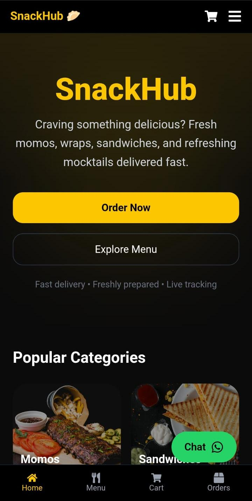
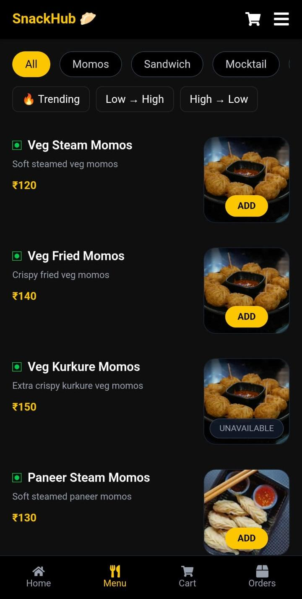
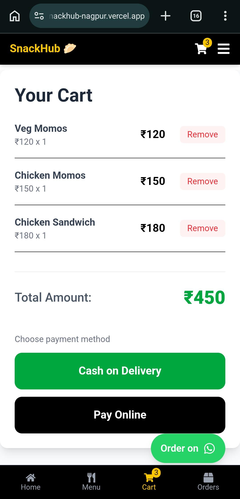
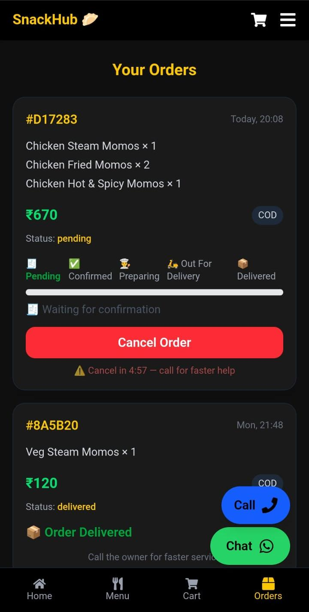
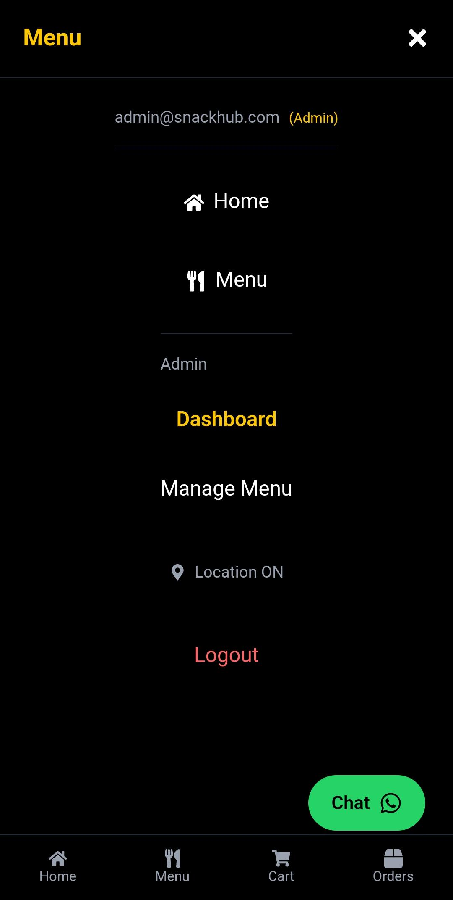
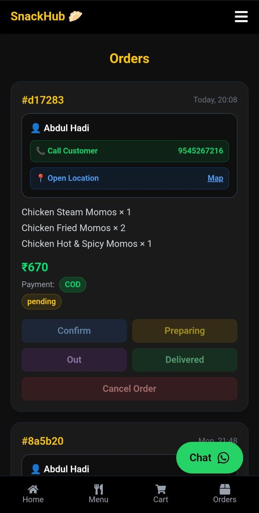
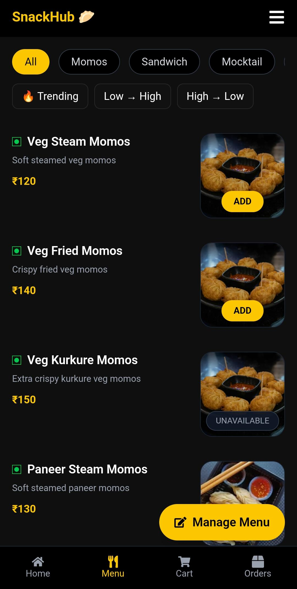
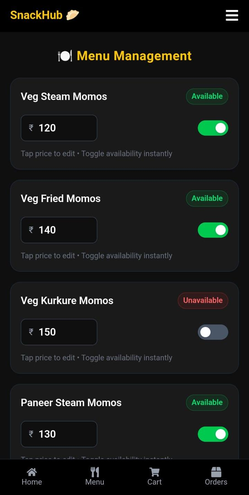

# 🍟 SnackHub — Production-Ready MERN Food Delivery Platform

> 🚀 A full-stack, real-world food delivery platform built with the MERN stack, featuring hybrid authentication, secure online payments, role-based access control, and real-time order lifecycle management.
>
> Designed with production-grade architecture inspired by platforms like Swiggy and Zomato.

<p align="center">
  
  
  
  
  
</p>

<p align="center">
  <a href="https://snackhub-nagpur.vercel.app"></a>
  <a href="https://snackhub-backend.onrender.com"></a>
</p>

---

## ✨ Overview

SnackHub is a modern, scalable food ordering platform that simulates how real-world delivery systems operate. It goes far beyond a standard CRUD project by integrating authentication, payments, real-time updates, and role-based workflows into one cohesive production-ready application.

Whether you're exploring full-stack architecture, authentication strategies, or scalable MERN development, SnackHub demonstrates practical engineering patterns used in modern web applications.

---

## 🎬 Demo Video

https://github.com/user-attachments/assets/8c7b92f3-1d67-42df-b689-dc4a0b41d329

---

## 🌟 Why SnackHub Stands Out

* 🔐 **Hybrid Authentication System** — Google, Email/Password, and Phone OTP via Firebase
* 🛡️ **Secure Authorization Layer** — Firebase authentication combined with JWT-protected APIs
* 🔄 **Real-Time User Synchronization** — Seamless Firebase-to-MongoDB user sync
* 👥 **Role-Based Access Control** — Separate experiences for Admins and Customers
* 💳 **Production Payment Flow** — Razorpay integration with server-side verification
* 📦 **Real-Time Order Management** — Live order lifecycle tracking
* 🏗️ **Scalable Backend Architecture** — Modular REST API design
* 📱 **Responsive UI/UX** — Optimized for mobile, tablet, and desktop

---

## 🚀 Live Demo

<p align="center">
  <a href="https://snackhub-nagpur.vercel.app">
    
  </a>
</p>

---

## 📱 User Experience

### 👤 Customer Interface

<p align="center">
  
  
  
  
</p>

<p align="center"><sub>Browse menu, manage cart, place orders, and track deliveries in real time.</sub></p>

---

### 🛠️ Admin Dashboard

<p align="center">
  
  
  
  
</p>

<p align="center"><sub>Manage orders, update statuses, and control menu inventory with ease.</sub></p>

---

## 🧠 System Architecture

```text
React (Vite Frontend)
        ↓
Firebase Authentication
(Google • Email • Phone OTP)
        ↓
JWT Authorization Layer
        ↓
Express.js REST API
        ↓
MongoDB Atlas Database
(Users • Menu • Orders)
        ↓
Razorpay Payment Gateway
        ↓
Real-Time Order Updates
```

### 🏗️ Architectural Principles

* **Separation of Concerns** — Authentication, business logic, and payments are independently managed
* **Scalability** — Modular backend design enables easy feature expansion
* **Security First** — Token verification, protected routes, and payment validation
* **Maintainability** — Clean code structure and reusable components

---

## 💳 Payment Workflow

* Secure checkout powered by Razorpay
* Server-side payment signature verification
* Protection against fake or unpaid orders
* Handles success, failure, and pending states gracefully
* Order creation only after successful payment validation

---

## 📍 Real-Time Order Tracking

Customers can track their orders through every stage:

* 🕐 Order Placed
* 👨‍🍳 Preparing
* 🚚 Out for Delivery
* ✅ Delivered

Admins can update order statuses instantly, and customers see changes in real time without refreshing the page.

---

## 🏗️ Tech Stack

### Frontend

* ⚛️ React.js (Vite)
* 🎨 Tailwind CSS / Framer Motion
* 🌐 React Router DOM
* 🧠 Context API
* 🔥 Firebase SDK
* ⚡ Axios

### Backend

* 🟢 Node.js
* 🚂 Express.js
* 🗄️ MongoDB Atlas + Mongoose
* 🔐 Firebase Admin SDK
* 🪪 JWT Authentication

### Third-Party Services

* 🔥 Firebase Authentication
* 💳 Razorpay Payment Gateway
* ☁️ MongoDB Atlas
* ▲ Vercel Deployment
* 🚀 Render Backend Hosting

---

## 🔥 Core Features

* Hybrid Authentication (Google, Email, Phone OTP)
* Secure JWT-Based API Authorization
* Role-Based Access Control (Admin / Customer)
* Dynamic Menu Management
* Cart and Checkout Workflow
* Razorpay Payment Integration
* Real-Time Order Tracking
* Admin Order Management Dashboard
* Firebase to MongoDB User Synchronization
* Fully Responsive Cross-Device Interface

---

## 🚀 Deployment Architecture

| Layer          | Platform      |
| -------------- | ------------- |
| Frontend       | Vercel        |
| Backend        | Render        |
| Database       | MongoDB Atlas |
| Authentication | Firebase      |
| Payments       | Razorpay      |

---

## ⚙️ Local Development Setup

```bash
git clone https://github.com/hadishah123/snackhub.git
cd snackhub
```

### Install Dependencies

```bash
# Frontend
cd frontend
npm install

# Backend
cd ../backend
npm install
```

### Configure Environment Variables

Create `.env` files for both frontend and backend with:

* Firebase configuration
* MongoDB connection URI
* JWT secret
* Razorpay credentials

### Start Development Servers

```bash
# Backend
cd ../backend
npm start

# Frontend (in a separate terminal)
cd ../frontend
npm run dev
```

---

## 📂 Project Highlights

* Clean folder structure
* Reusable component architecture
* Protected route implementation
* Scalable API design
* Production deployment workflow
* Industry-standard authentication flow

---

## 🎯 Ideal For Demonstrating

* Full-Stack MERN Development
* Authentication Architecture
* Payment Gateway Integration
* Role-Based Authorization
* REST API Design
* Real-Time Application Workflows
* Production Deployment Practices

---

## 🤝 Contributing

Contributions, ideas, and improvements are always welcome.

1. Fork the repository
2. Create a feature branch
3. Commit your changes
4. Push to your branch
5. Open a Pull Request

---

## 📜 License

This project is licensed under the MIT License. See the [LICENSE](LICENSE) file for details.

---

## 👨‍💻 Author

**Hadi Shah**

* GitHub: [@hadishah123](https://github.com/hadishah123)
* LinkedIn: [Hadi Shah](https://linkedin.com/in/hadishah123)

---

## ⭐ Support the Project

If you found SnackHub useful or inspiring:

* ⭐ Star the repository
* 🍴 Fork the project
* 🐛 Report issues
* 💡 Suggest new features
* 🤝 Contribute improvements

<p align="center">
  <b>Built with passion, code, and lots of snacks 🍕</b>
</p>
