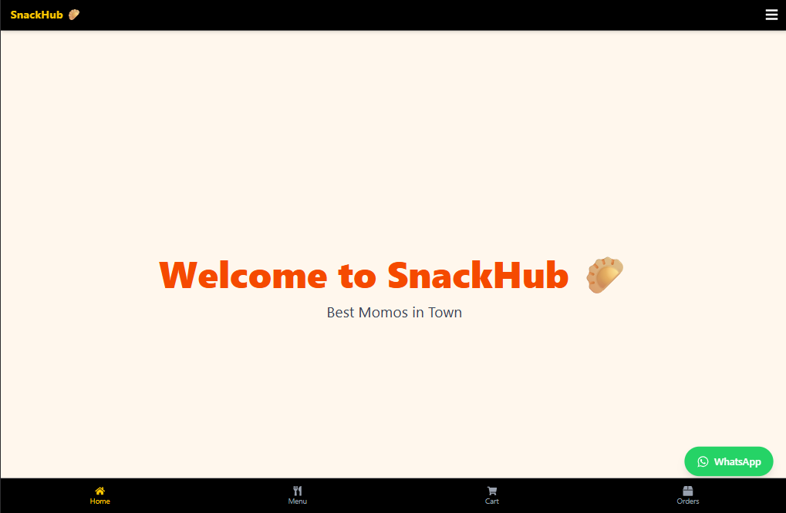
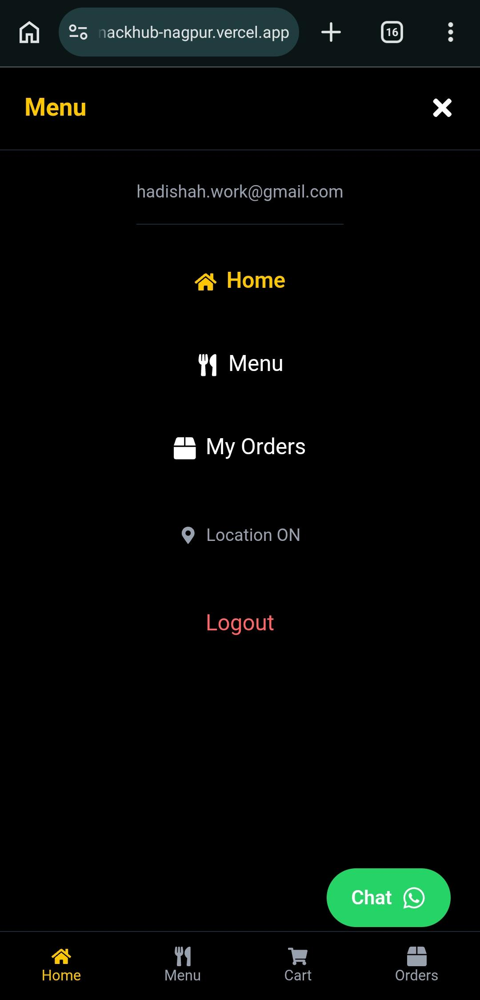
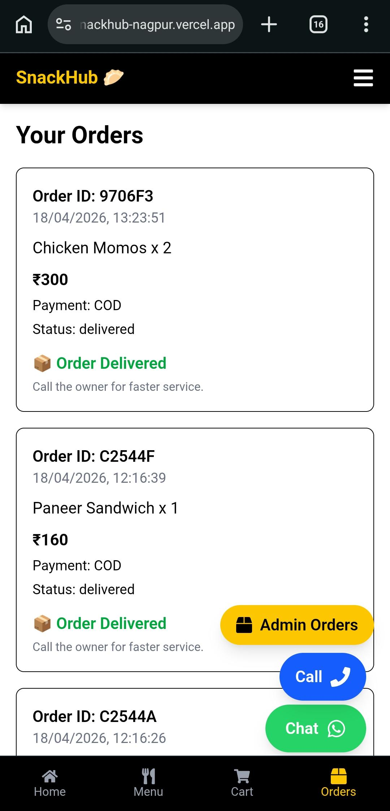
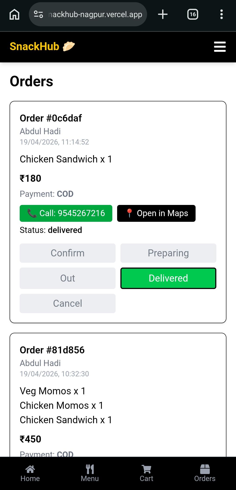
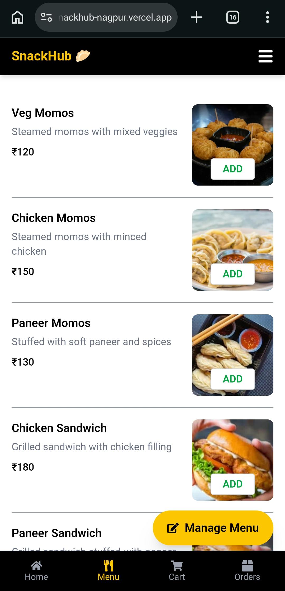
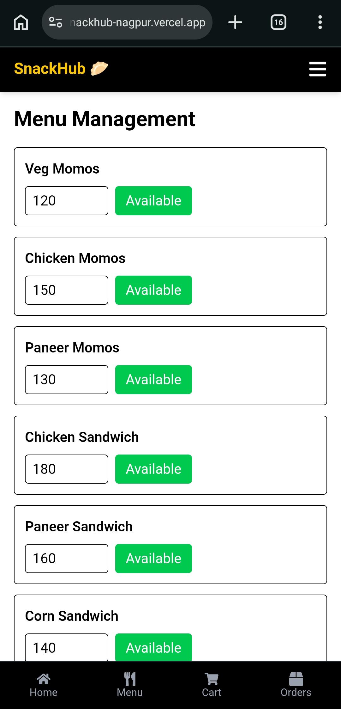

# 🍟 SnackHub — MERN Food Delivery App with Firebase Auth

> 🚀 Production-ready full-stack food delivery system with Hybrid Authentication (Google, Email, OTP) and real-time MongoDB sync.  
> 🧠 Built using real-world architecture patterns including authentication separation, role-based access control, and scalable backend design.  
> ⚙️ Demonstrates end-to-end production-grade system design inspired by platforms like Swiggy/Zomato.

<p align="center">
  
  
  
</p>

<p align="center">
  <a href="https://snackhub-nagpur.vercel.app"><b>🔥 Live Demo</b></a> •
  <a href="https://snackhub-backend.onrender.com"><b>⚙️ API</b></a>
</p>

## 🎥 Demo

<p align="center">
  
</p>

---

## 💥 Why SnackHub?

Unlike typical tutorial-based food delivery clones:

- 🔐 Secure authentication with Firebase + JWT separation
- ⚡ Real-time user sync between Firebase and MongoDB
- 🧠 Scalable role-based system (Admin / Customer)
- 🚀 Production-style backend architecture with REST APIs

---

## ⚡ Try It Instantly

<p align="center">
  <a href="https://snackhub-nagpur.vercel.app">
    
  </a>
</p>

---

## 📱 App Preview

### 👤 Customer Experience

<p align="center">
  <a href="./frontend/public/customer-view/nav.webp">
    
  </a>
  <a href="./frontend/public/customer-view/menu.webp">
    
  </a>
  <a href="./frontend/public/customer-view/cart.webp">
    
  </a>
  <a href="./frontend/public/customer-view/orders.webp">
    
  </a>
</p>

<p align="center"><sub>🔍 Click images to view full size</sub></p>

---

### 🛠️ Admin Panel

<p align="center">
  <a href="./frontend/public/admin-view/orders.webp">
    
  </a>
  <a href="./frontend/public/admin-view/admin-orders.webp">
    
  </a>
  <a href="./frontend/public/admin-view/menu.webp">
    
  </a>
  <a href="./frontend/public/admin-view/manage-menu.webp">
    
  </a>
</p>

<p align="center"><sub>🔍 Click images to view full size</sub></p>

---

## 🧠 Architecture

```
Frontend (React + Vite)
        ↓
Firebase Auth (Google / Email / OTP)
        ↓
JWT Verification (Express Middleware)
        ↓
Node.js + Express API
        ↓
MongoDB (Users • Orders • Menu)
        ↓
Razorpay (Payments)
        ↓
Real-time Order Updates
```

### 💡 Architecture Principle
> Separation of concerns: Authentication (Firebase), Business Logic (Express), and Payments (Razorpay) are fully decoupled for scalability, security, and real-world production behavior.

---

## 🚀 Production-Grade Integrations

SnackHub goes beyond a typical CRUD project by integrating real production services:

### 💳 Razorpay Payment Flow
- Secure checkout using Razorpay gateway
- Payment verification before order confirmation
- Handles success, failure, and pending states
- Prevents fake or unpaid orders

### 📍 Live Order Tracking System
- Real-time order status updates:
  - 🕐 Placed
  - 👨‍🍳 Preparing
  - 🚚 Out for Delivery
  - ✅ Delivered
- Instant UI updates without refresh
- Admin-controlled order lifecycle management

> ⚡ This makes SnackHub behave like a real Swiggy/Zomato-style system, not just a demo app.

## 🏗️ Tech Stack

### 🎨 Frontend
- ⚛️ React (Vite) — Fast SPA development & optimized builds  
- 🔥 Firebase SDK — Authentication (Google, Email, OTP)  
- 🌐 React Router — Client-side routing  
- 🧠 Context API — Global state management  
- ⚡ Axios — API communication layer  
- 🎨 Tailwind CSS / Material UI — Responsive UI components  

---

### 🚀 Backend
- 🟢 Node.js — Runtime environment  
- 🚂 Express.js — REST API framework  
- 🗄️ MongoDB (Mongoose) — NoSQL database modeling  
- 🔐 Firebase Admin SDK — Secure token verification  
- 🪪 JWT — Authentication & session management  

---

## 🚀 Deployment Architecture

- 🎨 Frontend: Vercel (React + Vite build)
- ⚙️ Backend: Render (Node.js + Express API)
- 🗄️ Database: MongoDB Atlas (Cloud NoSQL database)

---

## 🔥 Core Features

- 🔐 Hybrid Authentication (Google, Email, Phone OTP)
- 🛒 Full Cart & Checkout System
- 💳 Razorpay Payment Gateway Integration
- 📍 Live Order Tracking System (Real-time status updates)
- 🧠 Role-Based Access Control (Admin / Customer)
- 📦 Secure REST API with JWT authentication
- 🔄 Firebase → MongoDB real-time user sync
- 📱 Fully responsive UI (Mobile + Desktop)

---

## ⚡ Run Locally

```bash
git clone https://github.com/hadishah123/snackhub.git

cd ./frontend && npm install
cd ./backend && npm install

npm run server
npm run dev
```

> ⚠️ Requires Firebase + MongoDB `.env` setup

---

## 🙌 Final Note

This project was built to demonstrate production-level full-stack engineering skills including authentication architecture, backend design, and real-time system integration.

If you found this interesting, feel free to explore the codebase or suggest improvements.

---

## 📜 License

This project is open-source and available under the [MIT License](LICENSE).

---

## 👨‍💻 Author

**Hadi Shah**

- GitHub: [@hadishah123](https://github.com/hadishah123)  
- LinkedIn: [Hadi Shah](https://linkedin.com/in/hadishah123)

---

⭐ If you liked this project, don’t forget to star the repo!